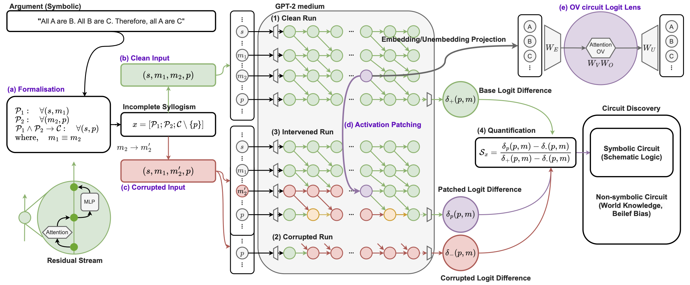

# Reasoning Circuits in Language Models: A Mechanistic Interpretation of Syllogistic Inference

**Authors:**  
Geonhee Kim, Marco Valentino, André Freitas

---



## Overview

This repository contains the official codebase for the paper:

> **Reasoning Circuits in Language Models: A Mechanistic Interpretation of Syllogistic Inference**  
> Geonhee Kim, Marco Valentino, André Freitas  
> [arXiv:2408.08590](https://arxiv.org/abs/2408.08590)

The project provides a mechanistic analysis of how large language models perform syllogistic inference, offering insights into the internal reasoning circuits that underpin logical reasoning capabilities in auto-regressive models.

## Project Setup

To install the required dependencies and set up the environment, please run:

```bash
conda create -n mechsyllogism python=3.9 -y
conda activate mechsyllogism
bash ./scripts/install_dependencies.sh

cd ./scripts
jupyter notebook main.ipynb
```

## Citation

If you use this codebase or find our work helpful, please cite:

> **Reasoning Circuits in Language Models: A Mechanistic Interpretation of Syllogistic Inference**  
> Geonhee Kim, Marco Valentino, André Freitas  
> *Findings of ACL 2025 (to appear)*  
> [arXiv:2408.08590](https://arxiv.org/abs/2408.08590)


```bibtex
@article{kim2024reasoning,
  title={Reasoning Circuits in Language Models: A Mechanistic Interpretation of Syllogistic Inference},
  author={Kim, Geonhee and Valentino, Marco and Freitas, André},
  journal={arXiv preprint arXiv:2408.08590},
  year={2025},
  note={Accepted to Findings of ACL 2025}
}